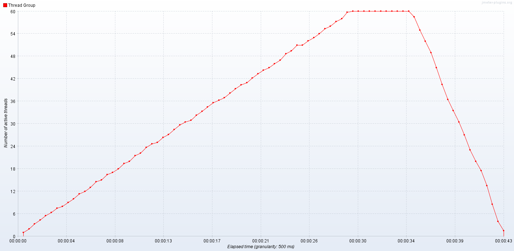

# Отчет по выполнению домашнего задания. Заняние 6. Индексы: оптимизация запросов

## Генерация анкет

Сгенерировал 1 000 000 анкет.

Для того, чтобы данные были похожи на настоящие, использовал библиотеку [Mimesis](https://mimesis.name/en/master/).

Скрипт, используемый для генерации данных: [generate_profiles.py](generate_profiles.py).

## Реализация функционала поиска анкет

Для поиска анкет использовался следующий SQL запрос:

```sql
SELECT id, first_name, last_name, birth_date, gender, biography, city
FROM profiles
WHERE first_name like $1 and last_name like $2
ORDER BY id
```

Переменные $1 и $2 заполняются значениями из соответствующих параметров HTTP запроса. Но так как поиск должен производиться по префиксу, к каждому значению добавил знак %. Детали реализации: [profile.go](../profile/repository/postgresql/profile.go).

## Проведение нагрузочных тестов

Нагрузочные тесты проводил с помощью утилиты JMeter, в течение 30 секунд постепенно увеличивая количетсво пользователей от 1 до 60. 

Для вывода графиков использовал следующие листенеры:
- jp@gc - Active Threads Over Time
- jp@gc - Reponse Latencies Over Time
- jp@gc - Bytes Throughput Over Time

Сохраненный профиль тестирования: [profile_search.jmx](profile_search.jmx).

## Выбор индекса

Для данной задачи подходит как B-Tree так и GIN индекс. Был выбран B-Tree индекс, так как требуется только поиск по префиксу, и полнотекстовой поиск не нужен. Для достижения наибольшего эффекта, создал двух-колоночный индекс по полям first_name и last_name. Так как в базе данных хранятся значения не в стандартной "C" локали, для поддержки оператора LIKE необхходимо указать класс оператора. Я использовал varchar_pattern_ops.

```sql
CREATE INDEX IF NOT EXISTS profiles_first_name_last_name_idx
ON profiles (first_name varchar_pattern_ops, last_name varchar_pattern_ops);
```

## Результаты EXPLAIN запросов

### Перед добавлением индекса

```
EXPLAIN SELECT id, first_name, last_name, birth_date, gender, biography, city
FROM profiles
WHERE first_name LIKE 'А%' AND last_name LIKE 'А%'
ORDER BY id;
                                            QUERY PLAN
--------------------------------------------------------------------------------------------------
 Sort  (cost=200718.00..200718.00 rows=1 width=1291)
   Sort Key: id
   ->  Gather  (cost=1000.00..200717.99 rows=1 width=1291)
         Workers Planned: 2
         ->  Parallel Seq Scan on profiles  (cost=0.00..199717.89 rows=1 width=1291)
               Filter: (((first_name)::text ~~ '?%'::text) AND ((last_name)::text ~~ '?%'::text))
 JIT:
   Functions: 2
   Options: Inlining false, Optimization false, Expressions true, Deforming true
(9 rows)
```

### После добавления индекса

```
EXPLAIN SELECT id, first_name, last_name, birth_date, gender, biography, city
FROM profiles
WHERE first_name LIKE 'А%' AND last_name LIKE 'А%'
ORDER BY id;
                                                                                  QUERY PLAN

-----------------------------------------------------------------------------------------------------------------------
--------------------------------------------------------
 Sort  (cost=8.47..8.47 rows=1 width=1291)
   Sort Key: id
   ->  Index Scan using profiles_first_name_last_name_idx on profiles  (cost=0.42..8.46 rows=1 width=1291)
         Index Cond: (((first_name)::text ~>=~ '?'::text) AND ((first_name)::text ~<~ '@'::text) AND ((last_name)::text
 ~>=~ '?'::text) AND ((last_name)::text ~<~ '@'::text))
         Filter: (((first_name)::text ~~ '?%'::text) AND ((last_name)::text ~~ '?%'::text))
(5 rows)
```

## Графики

### Потоки


### Latency (без индекса/с индексом)


### Throughput (без индекса / с индексом)


